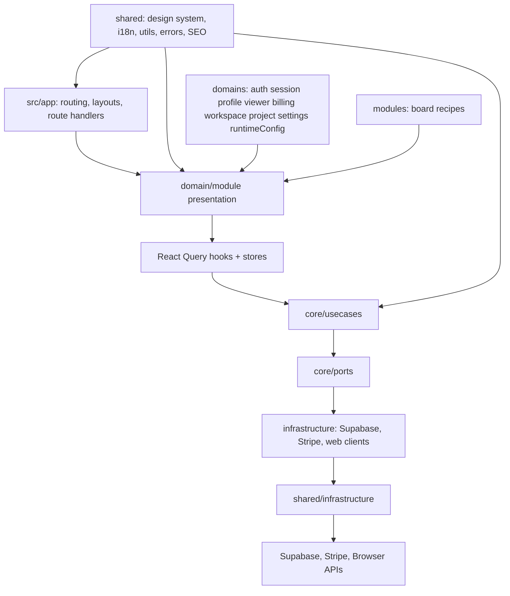
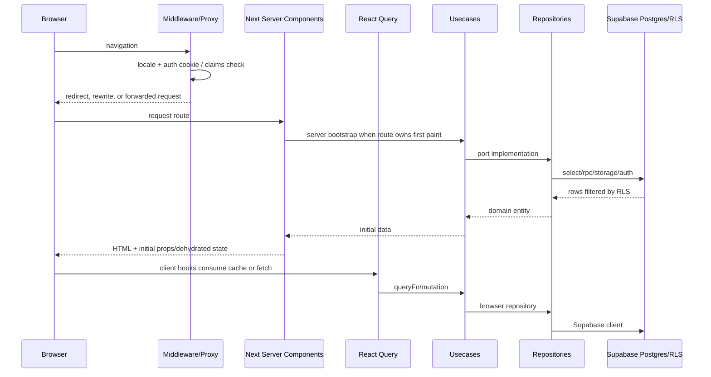
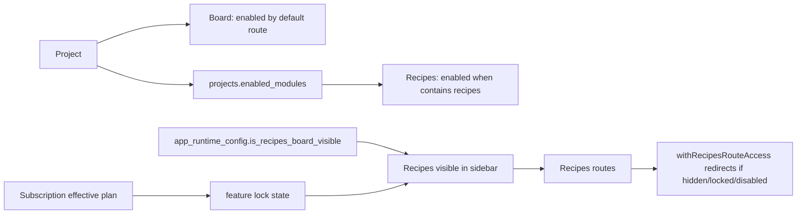

# 02 - Snapshot applicatif

## Vue systeme globale

```mermaid
flowchart LR
  User[Utilisateur web] --> Edge[Next edge gate: middleware.ts / src/proxy.ts]
  Edge --> PublicRoutes[Routes publiques marketing/auth/join]
  Edge --> ProtectedRoutes[Routes protegees workspace/project/account]

  PublicRoutes --> Marketing[Landing, pricing, legal, SEO]
  PublicRoutes --> Auth[Auth pages + callback]
  PublicRoutes --> Join[/join/:token]

  ProtectedRoutes --> AppProvider[AppProvider: Theme, QueryClient, ErrorBoundary, Toast, Analytics]
  AppProvider --> Workspace[/workspace]
  AppProvider --> ProjectShell[/:projectId shell]
  AppProvider --> Account[/account]
  AppProvider --> RuntimeLab[/runtime-config-lab]

  ProjectShell --> Board[Board module]
  ProjectShell --> Recipes[Recipes module]
  ProjectShell --> Settings[Project settings]

  Board --> BoardData[boards, columns, tickets, comments, ticket_assignees]
  Recipes --> RecipesData[recipes, tags, selections, shopping list]
  Workspace --> ProjectData[projects, project_members, stats]
  Account --> ProfileData[user_profiles, subscriptions, auth users, storage]
  Auth --> SupabaseAuth[Supabase Auth]
  Join --> Invitations[project_invitations RPC]
  Marketing --> RuntimeConfig[app_runtime_config]

  BoardData --> Supabase[(Supabase Postgres + RLS + Realtime)]
  RecipesData --> Supabase
  ProjectData --> Supabase
  ProfileData --> Supabase
  Invitations --> Supabase
  RuntimeConfig --> Supabase
  SupabaseAuth --> Supabase

  Account --> Stripe[Stripe API]
  Marketing --> Stripe
  Stripe --> Webhooks[/api/stripe/webhook]
  Webhooks --> Supabase

  Cron[Vercel Cron daily 00:00] --> ArchiveJob[/api/jobs/archive-completed-tickets]
  ArchiveJob --> Supabase
```

## Routes instant T

| Surface            | Route                                                                           | Owner code                                                                           | Type                        |
| ------------------ | ------------------------------------------------------------------------------- | ------------------------------------------------------------------------------------ | --------------------------- |
| Landing            | `/`, `/{locale}`                                                                | `src/app/marketing/[locale]/(marketing)/page.tsx` + `src/presentation/pages/landing` | server/public               |
| Pricing            | `/pricing`, `/{locale}/pricing`                                                 | `src/domains/billing/presentation/pages/pricing`                                     | server + client             |
| Legal              | `/legal`, `/{locale}/legal`                                                     | `src/presentation/pages/legal`                                                       | server/public               |
| Sign in            | `/auth/signin`                                                                  | `src/domains/auth/presentation/pages/signin`                                         | client                      |
| Sign up            | `/auth/signup`                                                                  | `src/domains/auth/presentation/pages/signup`                                         | client                      |
| Reset password     | `/auth/reset-password`                                                          | `src/domains/auth/presentation/pages/reset-password`                                 | client                      |
| Update password    | `/auth/update-password`                                                         | `src/domains/auth/presentation/pages/update-password`                                | client                      |
| Verify email       | `/auth/verify-email`                                                            | `src/domains/auth/presentation/pages/verify-email`                                   | client                      |
| Auth callback      | `/auth/callback`                                                                | `src/app/auth/callback/route.ts`                                                     | route handler               |
| Invitation         | `/join/:token`                                                                  | `src/domains/workspace/presentation/pages/join-invitation`                           | client                      |
| Workspace          | `/workspace`                                                                    | `src/domains/workspace/presentation/pages/workspace`                                 | server layout + client page |
| Project root       | `/:projectId`                                                                   | `src/app/(protected)/[projectId]/page.tsx`                                           | server redirect             |
| Board              | `/:projectId/board`                                                             | `src/modules/board/presentation/pages/board`                                         | server bootstrap + client   |
| Ticket detail      | `/:projectId/board/tickets/:ticketId`                                           | `src/modules/board/presentation/pages/ticket`                                        | client                      |
| Recipes catalog    | `/:projectId/recipes`                                                           | `src/modules/recipes/presentation/pages/recipes`                                     | server bootstrap + client   |
| Recipe detail      | `/:projectId/recipes/:recipeId`                                                 | `src/modules/recipes/presentation/pages/recipeDetail`                                | server                      |
| Recipe create      | `/:projectId/recipes/new`                                                       | `src/modules/recipes/presentation/pages/editor`                                      | server bootstrap + client   |
| Recipe edit        | `/:projectId/recipes/:recipeId/edit`                                            | `src/modules/recipes/presentation/pages/editor`                                      | server bootstrap + client   |
| Quick list         | `/:projectId/recipes/quick-list`                                                | `src/modules/recipes/presentation/pages/quickList`                                   | server + client cards       |
| Shopping list      | `/:projectId/recipes/shopping-list`                                             | `src/modules/recipes/presentation/pages/shopping`                                    | server + client card        |
| Project settings   | `/:projectId/settings`                                                          | `src/domains/project/presentation/pages/settings`                                    | client                      |
| Account            | `/account`                                                                      | `src/domains/settings/presentation/pages/account`                                    | client                      |
| Runtime config lab | `/runtime-config-lab`                                                           | `src/domains/runtimeConfig/presentation/pages/runtimeConfigLab`                      | protected lab               |
| APIs               | `/api/stripe/*`, `/api/auth/delete-user`, `/api/jobs/archive-completed-tickets` | `src/app/api/*`                                                                      | route handlers              |

`src/app/_isolated/*` contient un miroir de routes protegees et APIs. A l'instant T, il faut le traiter comme duplication technique a rationaliser, pas comme un second produit.

## Architecture code



## Frontieres de responsabilite

| Zone                    | Responsabilite                                          | Etat actuel                                                    |
| ----------------------- | ------------------------------------------------------- | -------------------------------------------------------------- |
| `src/app`               | routes, layouts, guards, metadata, APIs                 | globalement route-only                                         |
| `domains/auth`          | actions auth et credential flows                        | stable                                                         |
| `domains/session`       | session courante, claims, capabilities auth             | stable                                                         |
| `domains/profile`       | user profile, avatar, preferences                       | stable, preferences JSONB avec fallback code                   |
| `domains/viewer`        | read model utilisateur courant                          | stable                                                         |
| `domains/workspace`     | catalogue projets, stats, reclaim                       | stable                                                         |
| `domains/project`       | projet, membres, roles, invitations, shell, modules     | stable mais shell charge encore plusieurs concerns client-side |
| `domains/billing`       | subscriptions, entitlements, Stripe, runtime visibility | stable                                                         |
| `domains/runtimeConfig` | flags runtime key/value                                 | simple et utile                                                |
| `modules/board`         | Kanban, tickets, comments, assignees, realtime          | plus mature que Recipes                                        |
| `modules/recipes`       | catalogue, editor, quick list, shopping list            | fonctionnel mais encore v1 data-model/read-model               |
| `shared/design-system`  | primitives UI                                           | coherent, mais pas encore systematiquement icon-first/lucide   |

## Flux de donnees global



## Etat des modules



## Points notables a ne pas perdre

- `createAppQueryClient()` garde les queries fraiches 24h, avec `refetchOnWindowFocus: false`.
- `getProjectShellSnapshot()` et `getProjectRouteViewState()` sont `React.cache()` pour dedupliquer les lectures serveur par requete.
- `BoardPage` ne prefetch serveur que `boardConfiguration`; tickets et assignees se chargent client sauf initial props non fournis.
- `RecipesPage` precharge en parallele catalogue, tags et quick list.
- `BoardShellAdapter` evite de lancer la query `boardConfiguration` pendant SSR pour prevenir un mismatch hydration.
- `middleware.ts` et `src/proxy.ts` coexistent et divergent: c'est une dette operationnelle a trancher dans une version mature.
