# 03 - Flux de donnees par ecran

Ce document fige les donnees entrantes, les donnees consommees et les mutations par ecran principal.

## 1. Marketing home

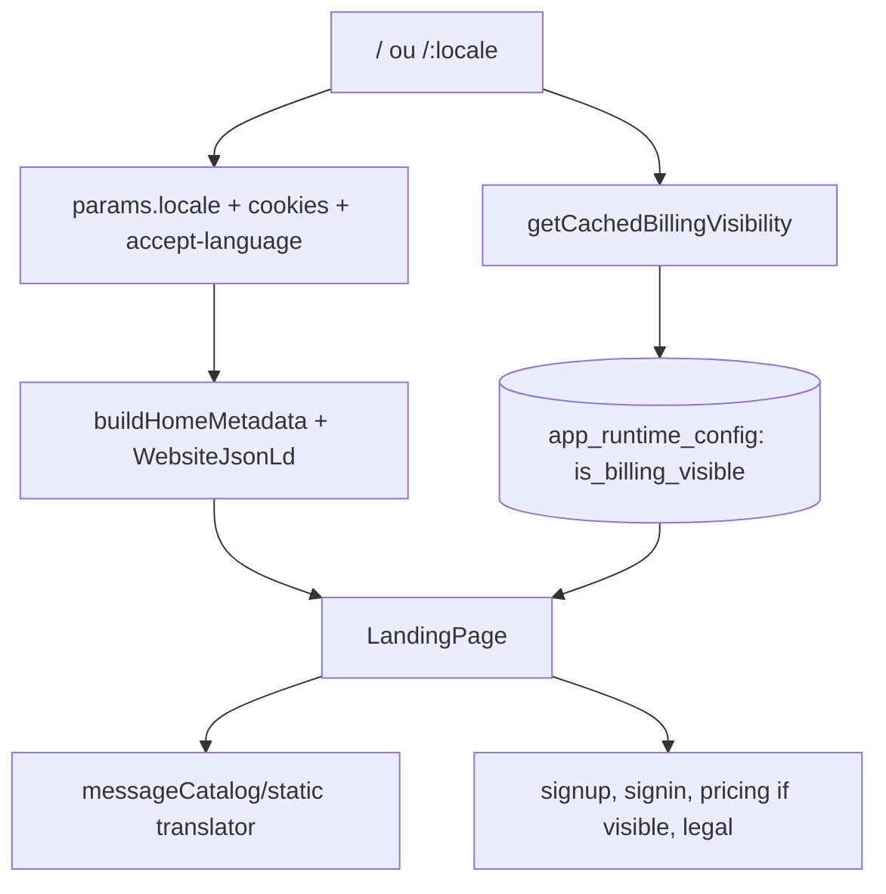

Donnees entrantes: locale, cookies locale, runtime billing visibility.  
Consommation: i18n statique, brand constants, landing constants.  
Mutation: aucune.

## 2. Pricing

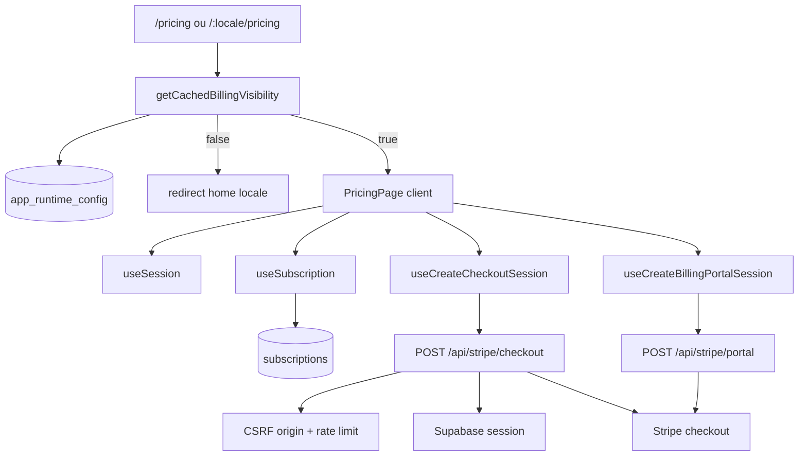

Donnees entrantes: locale, `from` search param, session optionnelle.  
Consommation: subscription courante, plans constants, runtime config.  
Mutations: creation session checkout/portal; webhook persiste `subscriptions`.

## 3. Legal

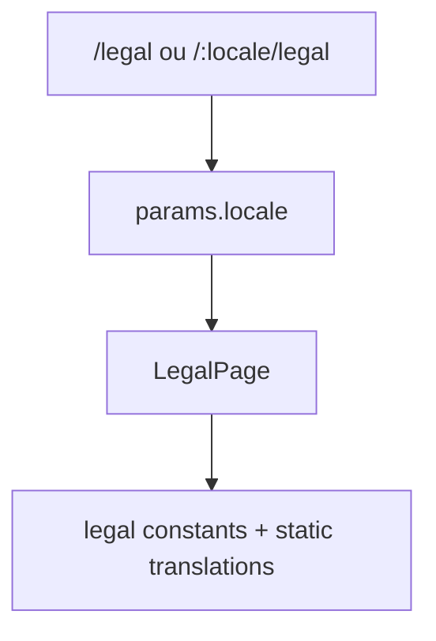

Donnees entrantes: locale.  
Consommation: contenu legal statique.  
Mutation: aucune.

## 4. Sign in

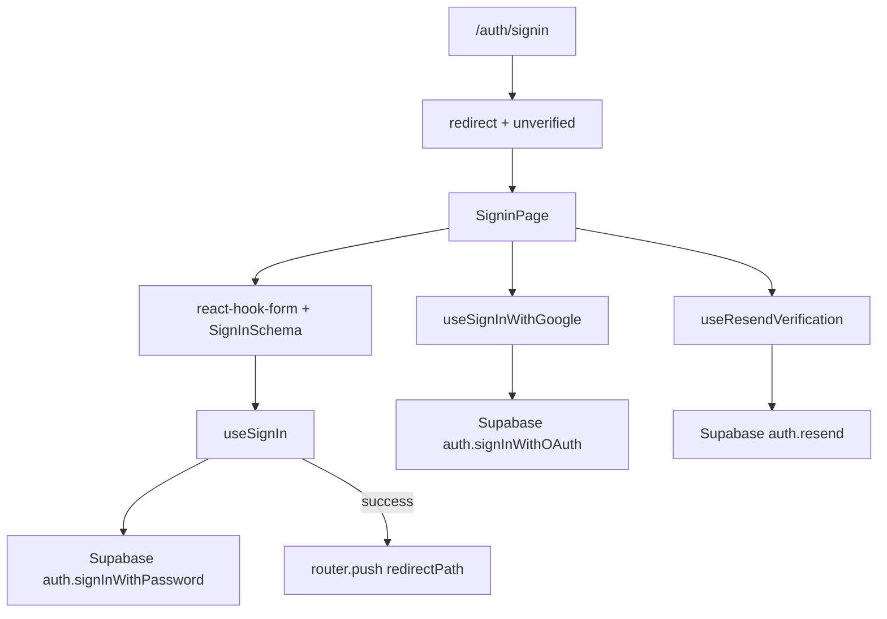

Donnees entrantes: redirect path, unverified flag.  
Consommation: Supabase Auth.  
Mutations: sign in, OAuth redirect, resend verification.

## 5. Sign up

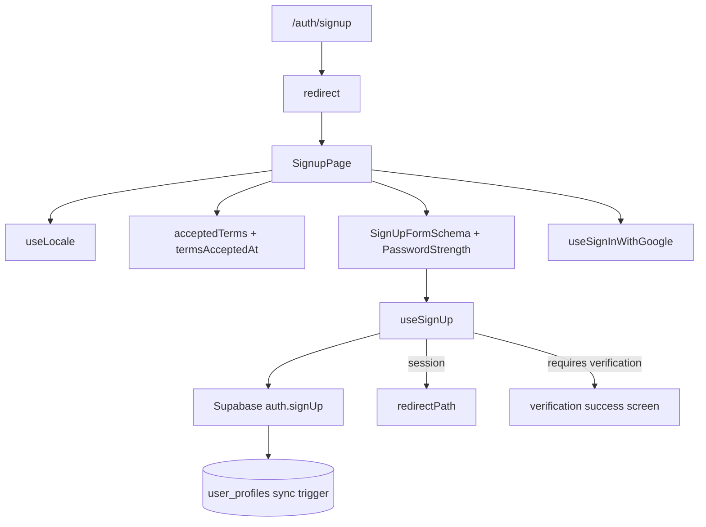

Donnees entrantes: redirect path, locale active.  
Consommation: Supabase Auth, profile trigger DB.  
Mutations: creation auth user, profile projection, optional OAuth.

## 6. Reset, update et verify email

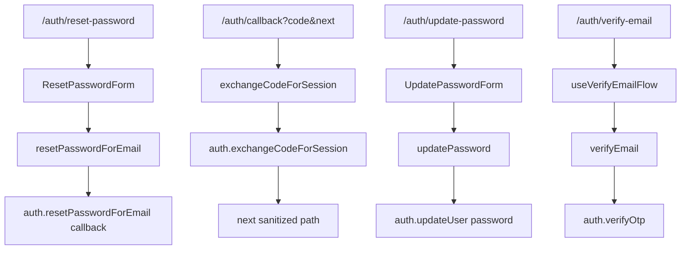

Donnees entrantes: email, code PKCE, token/type verification, password.  
Consommation: Supabase Auth.  
Mutations: reset email, exchange session, update password, verify OTP.

## 7. Join invitation

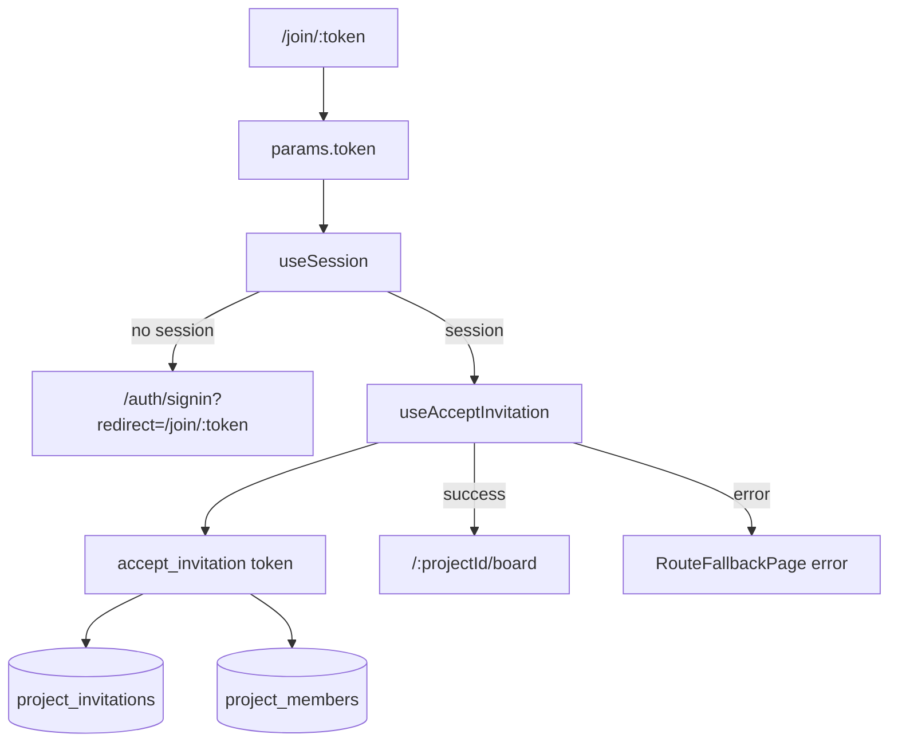

Donnees entrantes: invitation token, session.  
Consommation: invitation RPC.  
Mutations: delete/consume invitation selon migrations, insert membership.

## 8. Workspace

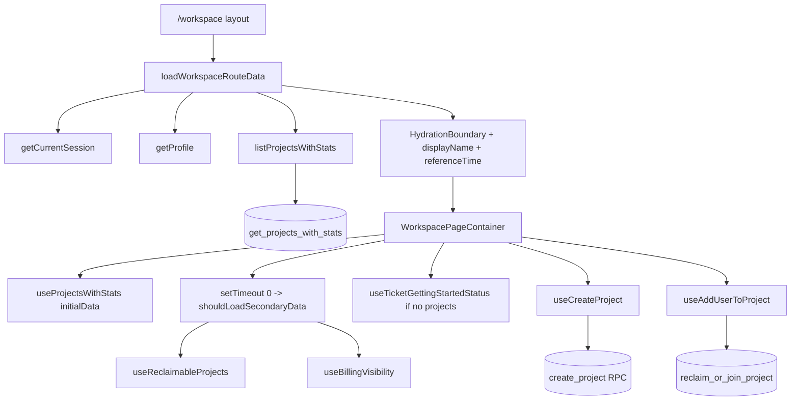

Donnees entrantes: auth cookies, locale, theme cookie.  
Consommation: session, profile, projects stats, runtime billing, reclaimable projects, profile getting-started.  
Mutations: create project, reclaim project, skip getting-started.

## 9. Project shell et project root

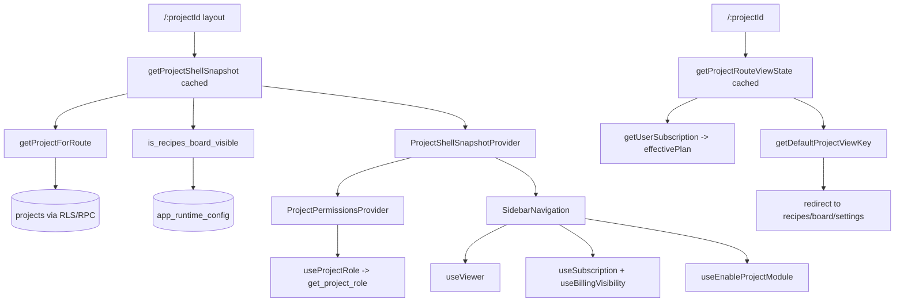

Donnees entrantes: `projectId`, cookies, runtime overrides.  
Consommation: project access, enabled modules, runtime config, role, viewer, subscription.  
Mutations: enable module, sign out from profile menu.

## 10. Board

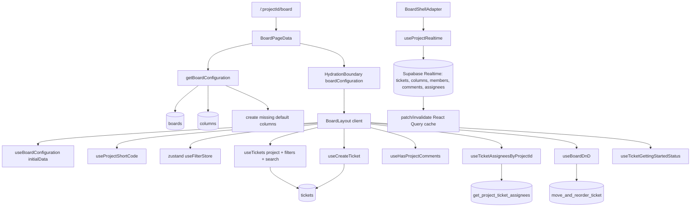

Donnees entrantes: `projectId`, query params `createTicket`, `onboarding`, legacy `ticket`, filter store.  
Consommation: board config, tickets, assignees, comments signal, role permissions.  
Mutations: create ticket, drag/move/reorder, update onboarding status.

## 11. Ticket detail

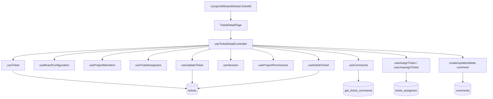

Donnees entrantes: `projectId`, `ticketId`, history state.  
Consommation: ticket, board columns, members, assignees, comments, current user, permissions.  
Mutations: fields, status, priority, due date, assignees, comments, delete, unarchive.

## 12. Recipes catalog

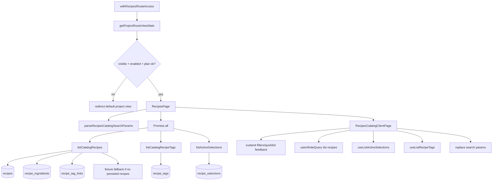

Donnees entrantes: `projectId`, search params `q`/filters, project module state, runtime flag, plan.  
Consommation: recipes page, tags, active selections.  
Mutations: quick list add/remove depuis cards et rail.

## 13. Recipe detail

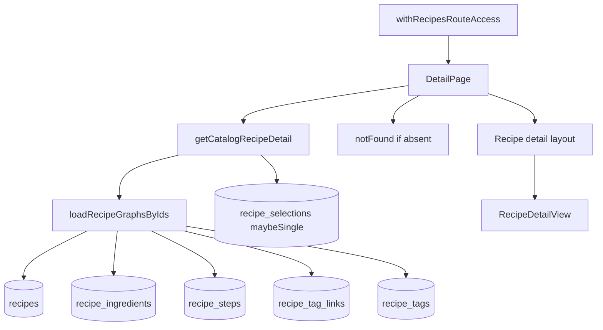

Donnees entrantes: `projectId`, `recipeId`.  
Consommation: graphe recette complet et etat quick list.  
Mutations: navigation vers edit, quick list selection selon composants detail.

## 14. Recipe editor create/edit

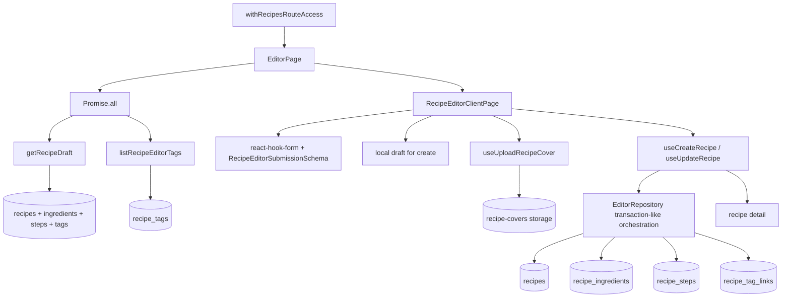

Donnees entrantes: `projectId`, `mode`, optional `recipeId`, local draft.  
Consommation: draft, available tags, file input.  
Mutations: cover upload, create/update recipe graph, local draft clear.

## 15. Recipes quick list

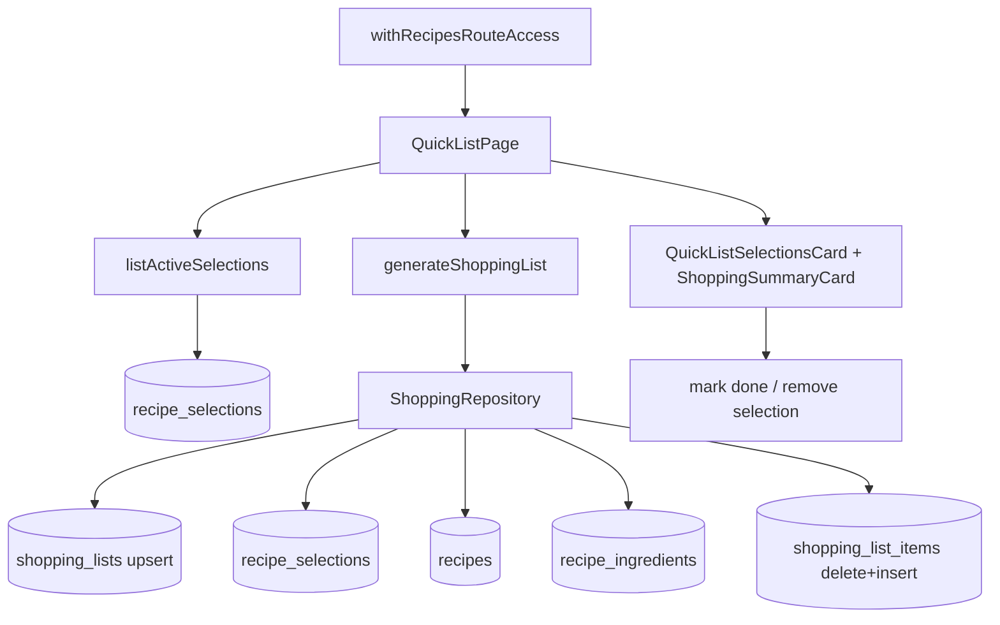

Donnees entrantes: `projectId`.  
Consommation: active selections, generated shopping list summary.  
Mutations: mark done/remove selection, generation shopping list persistante.

## 16. Recipes shopping list

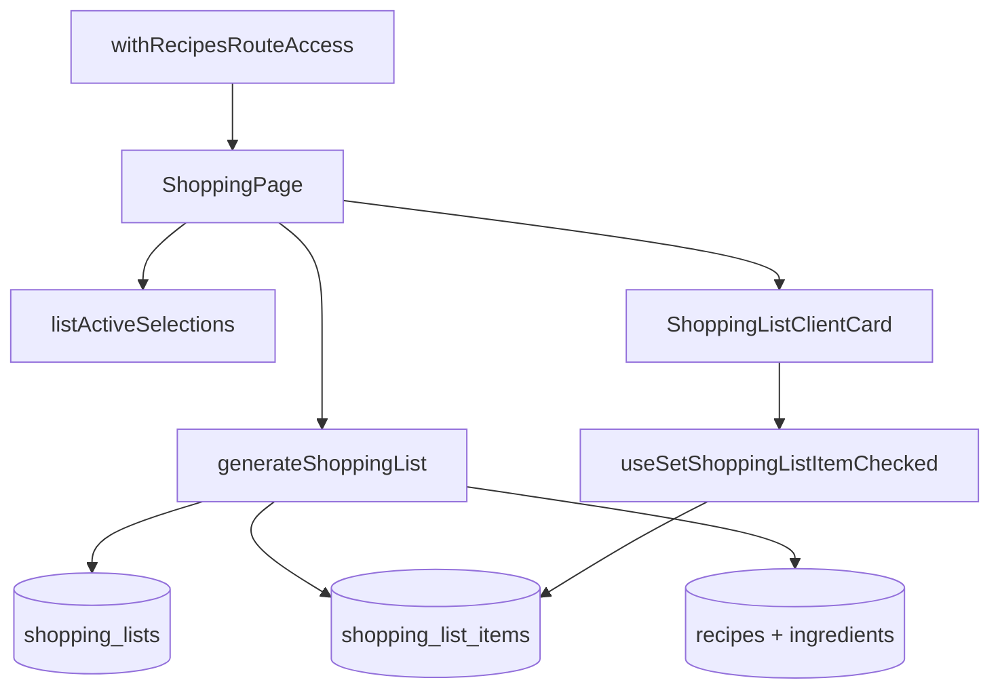

Donnees entrantes: `projectId`.  
Consommation: active selections, shopping list groups/items.  
Mutations: checkbox item checked, generation/rewrite items au chargement.

## 17. Project settings

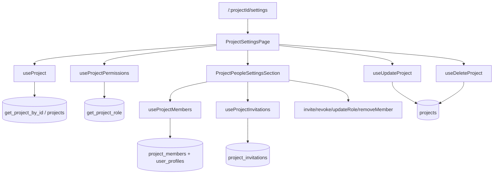

Donnees entrantes: `projectId`, role courant.  
Consommation: project, permissions, members, invitations.  
Mutations: update project, delete project, invite/revoke, role update, member removal.

## 18. Account

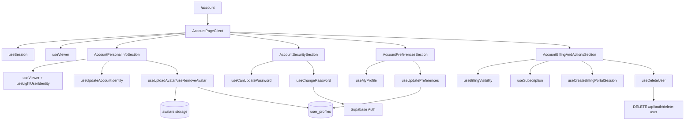

Donnees entrantes: `from`, `checkout=success`, session, viewer.  
Consommation: user profile, auth capabilities, billing visibility, subscription.  
Mutations: identity, avatar, password, preferences, portal session, sign out, delete account.

## 19. Runtime config lab

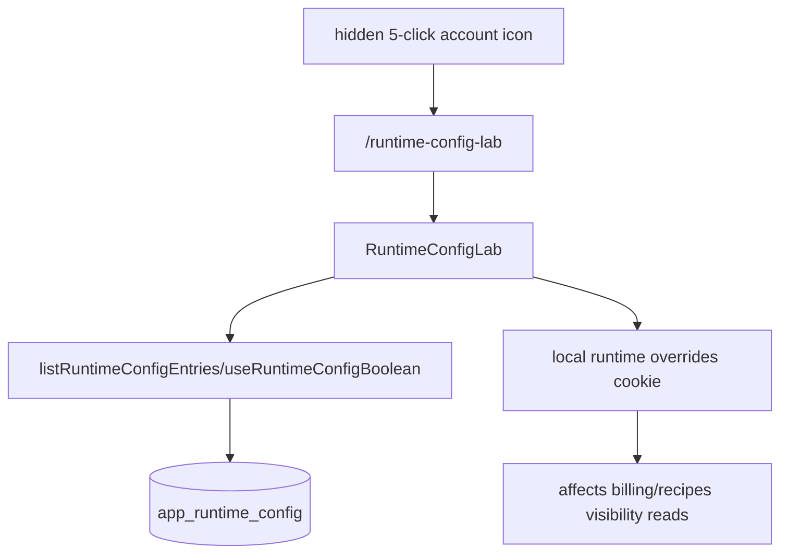

Donnees entrantes: protected session, cookies override.  
Consommation: runtime config entries.  
Mutations: locales/cookie overrides selon lab.

## 20. API et jobs

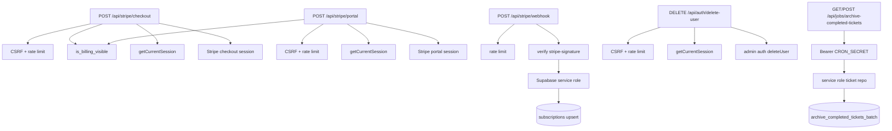

Points de controle: CSRF origin, rate limit memoire, Stripe signature, service role uniquement serveur, cron secret obligatoire.
