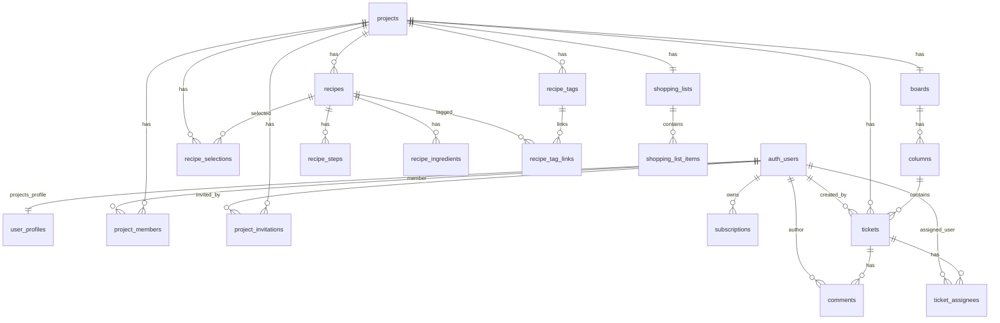

# 04 - Base de donnees

Source d'autorite: `supabase/migrations/`. Les types applicatifs owner-local vivent dans les domaines/modules et mappent les rows snake_case vers le domaine camelCase.

## Modele relationnel global



## Tables effectives

### `projects`

Attendu:

- `id uuid PK`
- `name text not null`
- `short_code text`: deux lettres, non unique depuis `000055`; l'identite fonctionnelle est `id`.
- `board_emoji text not null default '📋'`
- `enabled_modules text[] not null default '{}'`
- `creator_email`, `orphaned_at` selon lifecycle de reclamation
- `created_at`, `updated_at`

Relations:

- 1:1 `boards`
- 1:n `project_members`, `tickets`, `project_invitations`, `recipes`, `recipe_selections`

Attentes:

- creer un projet via RPC `create_project(project_name)` pour bootstrap membership admin;
- ne jamais utiliser `short_code` comme identifiant global;
- garder `enabled_modules` comme source de verite pour modules projet.

### `project_members`

Attendu:

- `id uuid PK`
- `project_id uuid FK projects`
- `user_id uuid FK auth.users`
- `role text in admin/member/viewer`
- unique `(project_id, user_id)`
- indexes sur `project_id`, `user_id`, `(project_id, user_id)`

Attentes:

- role admin requis pour gestion membres/invitations/suppression projet;
- dernier admin protege par trigger;
- suppression membre nettoie `ticket_assignees`.

### `project_invitations`

Attendu:

- `id`, `project_id`, `invited_by`
- `role`
- `token text unique`
- `status in pending/accepted/declined/expired`
- `expires_at`, timestamps
- l'ancien champ email est supprime en schema effectif recent; les invitations sont link-based.

Attentes:

- acceptation via RPC `accept_invitation(token)`;
- decline via `decline_invitation(token)`;
- lien single-use apres migration de suppression des invitations acceptees.

### `boards` et `columns`

`boards`:

- `id uuid PK`
- `project_id uuid unique FK projects`
- timestamps

`columns`:

- `id uuid PK`
- `board_id uuid FK boards`
- `name text`
- `key text`: identifiant technique normalise, unique par board en lower/trim.
- `state in todo/in_progress/done`: etat metier stable.
- `position integer >= 0`, unique par board.
- `visible boolean`

Attentes:

- `getBoardConfiguration()` garantit un board et au moins une colonne par etat workflow.
- la logique metier doit s'appuyer sur `state`, pas sur `name`.
- custom columns doivent preserver au moins un etat `done` et eviter la suppression de colonnes non vides.

### `tickets`

Attendu:

- `id uuid PK`
- `project_id uuid FK projects`
- `title text not null`
- `description text null`
- `column_id uuid not null FK columns on delete restrict`
- `position integer >= 0`
- `code_number integer`, unique `(project_id, code_number)`
- `priority in urgent/normal/low`
- `due_date date`
- `story_points integer > 0 null`
- `created_by uuid FK auth.users null`
- `completed_at timestamptz null`
- `archived_at timestamptz null`
- `archived_week_start date null`
- timestamps

Indexes importants:

- `(project_id, column_id, position)`
- partial `(project_id, column_id, position) where archived_at is null`
- `(project_id, code_number)`
- `(project_id, priority) where priority is not null`
- `(project_id, due_date) where due_date is not null`
- pending archive on `completed_at`
- trigram title/description from migration search

Attentes:

- `column_id` doit appartenir au meme projet que le ticket, garanti par trigger.
- board actif exclut `archived_at is not null`.
- mouvements drag and drop passent par `move_and_reorder_ticket` pour atomicite.
- archivage hebdo passe par `archive_completed_tickets_batch`.

### `ticket_assignees`

Attendu:

- `id uuid PK`
- `ticket_id uuid FK tickets`
- `project_id uuid not null`, derive par trigger depuis ticket.
- `user_id uuid FK auth.users`
- `assigned_by uuid FK auth.users null`
- `assigned_at`
- unique `(ticket_id, user_id)`

Attentes:

- lectures par project via RPC `get_project_ticket_assignees(project_id)`;
- `project_id` denormalise pour realtime filtre et RLS plus rapide.

### `comments`

Attendu:

- `id uuid PK`
- `ticket_id uuid FK tickets`
- `project_id uuid not null`, derive par trigger
- `author_id uuid FK auth.users`
- `content text not null`
- timestamps

Attentes:

- lecture detail via RPC `get_ticket_comments(ticket_id)` pour enrichir author profile;
- update author-only;
- delete author ou admin.

### `user_profiles`

Attendu:

- `id uuid PK FK auth.users`
- `email`
- `display_name`
- `avatar_url`
- `preferences jsonb`
- `terms_accepted_at`
- timestamps

Preferences attendues cote code:

```ts
type UserPreferences = {
  theme: "light" | "dark" | "system";
  emailNotifications: boolean;
  language: string;
  gettingStartedStatus: "pending" | "skipped" | "completed";
};
```

Note: le default SQL historique ne contient pas toujours `gettingStartedStatus`; le mapper applicatif complete par fallback. Une migration de consolidation devrait aligner le default DB avec le type applicatif.

### `subscriptions`

Attendu:

- `id uuid PK`
- `user_id uuid unique FK auth.users`
- `plan in free/pro/team`
- `status in active/canceled/past_due/trialing`
- `stripe_customer_id unique`
- `stripe_subscription_id unique`
- period start/end, cancel flag, timestamps

Attentes:

- absence de row = plan free via domain fallback;
- read self via RLS;
- writes uniquement service role via webhook Stripe.

### `app_runtime_config`

Attendu:

- `key text PK`
- `value jsonb`
- `updated_at`

Keys connues:

- `is_billing_visible`
- `is_recipes_board_visible`

Attentes:

- public read pour anon/authenticated;
- overrides locaux lus depuis cookie pour lab/dev.

### Recipes

`recipes`:

- `id`, `project_id`
- `title`, `summary`
- `total_time_minutes`, `total_time_label`
- `servings_count`, `servings_label`
- `note`, `cover_image_url`, `cover_style`
- timestamps
- unique `(id, project_id)`

`recipe_steps`:

- `project_id`, `recipe_id`
- `position > 0`, `title`, `instruction`, `notes`, `meta`
- unique `(project_id, recipe_id, position)`

`recipe_ingredients`:

- `project_id`, `recipe_id`
- `position > 0`
- `display_name`, `normalized_name`
- `amount_value numeric(10,3)`, `amount_text`, `unit`, `notes`
- `kind in validated/addition_candidate`
- unique `(project_id, recipe_id, position)`

`recipe_tags` et `recipe_tag_links`:

- tags uniques par `(project_id, slug)`
- link PK `(project_id, recipe_id, tag_id)`

`recipe_selections`:

- quick list active
- unique `(project_id, recipe_id)`
- `position`, note, servings override

`shopping_lists` et `shopping_list_items`:

- une shopping list par project
- items groupes par `group_id`, `group_title`, `position`
- ingredient snapshot + `checked`
- `recipe_sources jsonb[]`

Attentes:

- search catalogue lit `recipes.title`, `recipes.summary`, `recipe_ingredients.display_name`, `normalized_name`;
- filtres tags passent par `recipe_tags` + `recipe_tag_links`;
- shopping generation reconstruit les items et preserve `checked` quand possible.

## RPC et fonctions critiques

```mermaid
flowchart TD
  create_project --> projects
  create_project --> project_members
  get_project_by_id --> projects
  get_projects_with_stats --> projects
  get_projects_with_stats --> project_members
  get_projects_with_stats --> tickets
  get_projects_with_stats --> columns
  get_project_role --> project_members
  reclaim_or_join_project --> project_members
  accept_invitation --> project_invitations
  accept_invitation --> project_members
  decline_invitation --> project_invitations
  get_ticket_comments --> comments
  get_ticket_comments --> user_profiles
  get_ticket_assignees --> ticket_assignees
  get_project_ticket_assignees --> ticket_assignees
  move_and_reorder_ticket --> tickets
  update_ticket_positions --> tickets
  archive_completed_tickets_batch --> tickets
```



## RLS

Principe:

- `auth.uid()` et les helper functions sont la source d'identite.
- Membership projet est le perimetre principal de lecture.
- `admin/member` peuvent editer le work data.
- `viewer` lit seulement.
- billing read self, writes service role.
- runtime config public read.

Helpers:

- `is_project_member(project_uuid)`
- `get_project_role(project_uuid)`
- `is_project_admin(project_uuid)`
- `can_edit_project(project_uuid)`
- `has_any_project_access()`

Optimisation cible:

- utiliser le pattern `(select auth.uid())` dans les policies pour eviter les evaluations row-by-row;
- indexer toutes les colonnes utilisees par RLS (`project_id`, `user_id`, foreign keys);
- consolider les policies permissives multiples si le comportement reste identique et teste.

## Realtime

Tables suivies cote board shell:

- `tickets` filtre `project_id`
- `columns` filtre `board_id`
- `project_members` filtre `project_id`
- `comments` et `ticket_assignees` via subscriptions dediees

Attente mature:

- `comments.project_id` et `ticket_assignees.project_id` doivent rester non null et synchronises par triggers;
- DELETE realtime non filtre doit etre gere par invalidation prudente;
- realtime recipes n'est pas encore implemente.

## Stockage Supabase

- `avatars`: public avatars, upload/remove via `profileGateway`.
- `recipe-covers`: public cover images, upload via editor, policies folder user-owned.

Contraintes applicatives:

- validation taille et MIME avant upload;
- transformation WebP selon helpers browser;
- URL publique stockee dans `user_profiles.avatar_url` ou `recipes.cover_image_url`.

## Ecarts a corriger dans une reconstruction mature

- Creer une migration officielle pour les indexes signales comme appliques out-of-band dans `docs/supabase/migrations.md`: `comments.author_id`, `project_invitations.invited_by`, `ticket_assignees.assigned_by`, `tickets.created_by`.
- Aligner default JSONB `user_profiles.preferences` avec `gettingStartedStatus`.
- Remplacer les recherches catalogue multi-requetes par une fonction SQL/read model indexe.
- Eviter la regeneration destructive complete de `shopping_list_items` a chaque ouverture si la liste n'a pas change.
- Generer un type Supabase global ou un schema contractuel automatise, puis conserver les mappers owner-local.
