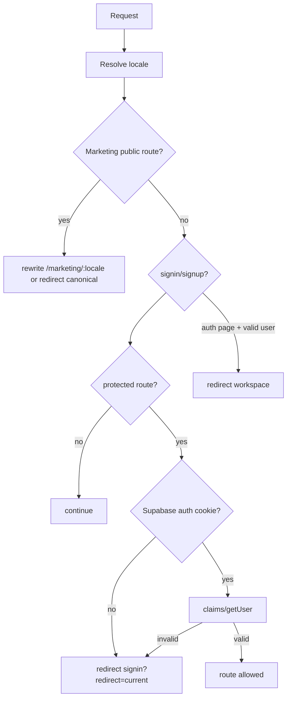

# 05 - Garde-fous, attentes et contraintes

## Garde-fous route et auth



Etat observe:

- `middleware.ts` gere i18n marketing, auth redirect, email verification.
- `src/proxy.ts` contient une version plus moderne avec claims, light user cookie et forwarded session header.
- Les deux fichiers divergent. Une app mature doit choisir un seul edge gate canonique pour eviter comportements differents selon version Next/runtime.

Garde-fou final:

- auth UX a l'edge pour eviter de charger des pages inutiles;
- authorization dans RLS et dans les route loaders projet;
- toute erreur de project access redirige vers `/workspace` fail-closed.

## Garde-fous project/module

```mermaid
flowchart TD
  ProjectRoute["/:projectId/*"] --> ShellSnapshot[getProjectShellSnapshot]
  ShellSnapshot --> GetProject[getProjectForRoute via RLS]
  ShellSnapshot --> RecipesFlag[is_recipes_board_visible]
  GetProject -->|error| WorkspaceRedirect[/workspace]
  ShellSnapshot --> Shell[ProjectShell]
  Shell --> Permissions[useProjectRole -> resolveProjectPermissions]

  RecipesRoute["/:projectId/recipes/*"] --> ViewState[getProjectRouteViewState]
  ViewState --> Checks{visible + module enabled + plan access}
  Checks -->|no| RedirectDefault[default accessible view]
  Checks -->|yes| RenderRecipes[render route]
```

Points clefs:

- `ProjectPermissionsProvider` derive les flags depuis `admin/member/viewer`.
- Recipes depend de trois conditions: runtime flag visible, module active dans `projects.enabled_modules`, entitlement plan.
- Le module library active Recipes via mutation `enableProjectModule`.

## Garde-fous API

| Endpoint                                       | Garde-fous                                                           |
| ---------------------------------------------- | -------------------------------------------------------------------- |
| `POST /api/stripe/checkout`                    | CSRF origin, rate limit 5/min, billing visible, session, plan valide |
| `POST /api/stripe/portal`                      | CSRF origin, rate limit 5/min, billing visible, session              |
| `POST /api/stripe/webhook`                     | rate limit 30/min, signature Stripe, raw body, service role          |
| `DELETE /api/auth/delete-user`                 | CSRF origin, rate limit 3/min, session, admin auth server-side       |
| `GET/POST /api/jobs/archive-completed-tickets` | `Authorization: Bearer CRON_SECRET`, service role                    |

## Garde-fous donnees

- Usecases valident les inputs avec Zod quand le flux est sensible.
- DB constraints verifient noms/titres non vides, role/status enums, positions, dues dates, project-column match.
- RLS refuse les lectures/mutations hors membership.
- `short_code` est decoratif, jamais cle d'identite.
- `ticket.column_id` est obligatoire et verifie par trigger.
- `comments.project_id` et `ticket_assignees.project_id` sont DB-owned.
- Les priorites ticket sont reduites a `urgent`, `normal`, `low`.
- Recipe ingredient merging est volontairement prudent: pas de fusion si quantite/unit/nom normalise ambigus.

## Ecrans d'attente

| Surface                       | Fallback                                                        |
| ----------------------------- | --------------------------------------------------------------- |
| `/workspace` layout           | `WorkspaceLoadingContent` avec `RouteFallbackPage tone=loading` |
| `/:projectId/*` layout        | `ProjectLoading` avec skeleton board                            |
| board route legacy `?ticket=` | `Loader full-page` puis redirect detail                         |
| BoardView                     | loading columns/tickets                                         |
| Create ticket modal           | message si aucune colonne ou read-only                          |
| Ticket detail                 | controleur expose `isLoading`, vue detail affiche loader/error  |
| Auth verify/update/reset      | `Loader inline` et success/error states                         |
| Account                       | full-page loader jusqu'a mount + session/viewer                 |
| Account security              | loader inline sur capability password                           |
| Billing account               | loader inline sur subscription                                  |
| Join invitation               | `RouteFallbackPage` loading puis error avec retry               |
| Recipes catalog               | `showInitialLoader`, refreshing state, infinite load controls   |
| Recipe detail/editor          | `notFound()` si recette absente                                 |
| Quick list/shopping           | server-render direct, cartes client gerent pending mutations    |

Attente mature:

- les skeletons doivent avoir hauteur stable et ne pas declencher layout shift;
- les loaders route doivent etre courts et remplaces par streaming/Suspense de sous-zones quand possible;
- les mutations longues doivent afficher pending local, pas bloquer tout l'ecran.

## Contraintes cold start

Risque actuel:

- Next Server Components + Supabase SSR client + Sentry + next-intl + Stripe peuvent augmenter le cold start sur routes serveur.
- Workspace charge session puis profile puis projects de maniere partiellement sequentielle.
- Project routes appellent `getProjectShellSnapshot`; les Recipes routes rappellent `getProjectRouteViewState`, meme si `React.cache()` deduplique par fonction et args uniquement dans la requete courante.
- Pricing public enveloppe `PricingPage` dans `AppProvider`, donc React Query/Theme/Analytics chargent sur une page marketing.
- `middleware.ts` peut appeler `auth.getUser()` a l'edge pour routes protegees; `src/proxy.ts` optimise avec claims en premier.

Cible:

- edge gate canonique claims-first;
- server loaders paralleles quand les donnees ne dependent pas les unes des autres;
- `React.cache()` pour session, project shell, runtime config, subscription par request;
- runtime config cache server TTL court ou revalidation explicite;
- eviter les providers app complets sur marketing quand non necessaires.

## Contraintes latence applicative

### Workspace

Actuel:

- first paint depend de session, profile, `get_projects_with_stats`.
- donnees secondaires reclaimable/billing chargees apres mount via `setTimeout(0)`.

Cible:

- garder `projects with stats` comme read model unique;
- charger billing visibility seulement si footer/pricing CTA visible au-dessus du fold;
- paralleliser session/profile quand session header forwarde est disponible;
- mesurer p95 `get_projects_with_stats`.

### Board

Actuel:

- serveur prefetch `boardConfiguration` uniquement.
- tickets/assignees chargent client; query staleTime 24h limite refetchs.
- realtime patch les tickets et invalide au besoin.

Cible:

- precharger board first paint complet: config + tickets actifs + assignees projet dans une seule boundary;
- envisager RPC/read model `get_board_snapshot(project_id)` qui retourne board, columns, tickets actifs, assignees par ticket, role;
- conserver realtime pour deltas, pas comme correctif de chargement initial.

### Ticket detail

Actuel:

- detail charge ticket, board config, members, assignees, comments separement.

Cible:

- RPC/read model `get_ticket_detail_snapshot(project_id, ticket_id)` incluant ticket, assignees, comments enrichis, status options, permissions minimales;
- prefetch au hover/focus deja amorce par board cards.

### Recipes

Actuel:

- catalogue serveur fait `Promise.all` catalogue/tags/quick list.
- recherche catalogue peut faire plusieurs requetes paralleles puis intersection en JS.
- detail charge graphe via helpers.
- shopping generation reecrit les items persistants.

Cible:

- `get_recipes_catalog_page(project_id, filters, cursor)` en SQL avec indexes trigram + tag joins;
- materialiser ou precomputeur `recipe_search_document` si volume fort;
- `get_recipe_detail_snapshot` pour detail/editor;
- shopping generation idempotente par hash de selections/ingredients pour eviter delete+insert si pas de changement.

## Observabilite et erreurs

Etat actuel:

- Sentry server/edge/instrumentation en production.
- `AppErrorBoundary` global.
- logger scoped via `createLoggerFactory`.
- Vercel Analytics + Speed Insights.
- Error mapping centralise vers messages i18n.

Cible:

- ajouter spans/metrics par usecase critique: workspace stats, board snapshot, recipes catalog, shopping generation, Stripe APIs;
- logger les query durations cote repository en dev/staging;
- dashboard p50/p95/p99 par route;
- alerting sur erreurs RLS inattendues, cron archival, webhooks Stripe.

## Tests garde-fous

Existant:

- tests UI design system;
- tests route/protected layouts;
- tests hooks board/project;
- tests migrations cles;
- tests repositories recipes;
- tests auth/utils/i18n.

A renforcer:

- tests contractuels Mermaid/PRD non necessaires, mais tests read model DB cibles oui;
- tests RLS par role sur recipes;
- tests performance SQL avec EXPLAIN sur catalog/search/workspace stats;
- tests e2e happy paths: signup -> workspace -> project -> board -> ticket detail -> recipes -> shopping.
