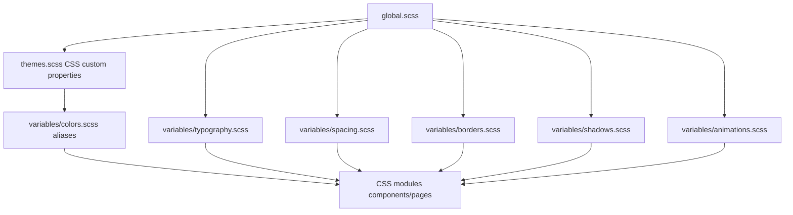

# 06 - Design system

## Intention visuelle

Le design system actuel est une palette chaude, textile et calme, issue de l'ancien univers `FlavieBoard`. L'application melange surfaces de productivite denses (workspace, board, settings) et moments plus editoriaux (landing, recipes). La cible mature doit conserver cette douceur tout en rendant les ecrans operationnels plus scannables et plus rapides.

## Sources

- Styles globaux: `src/styles/global.scss`
- Themes runtime: `src/styles/themes.scss`
- Variables SCSS: `src/styles/variables/*`
- Primitives: `src/shared/design-system/*`
- Reference legacy non routee: `flavieBoard/*`

## Tokens

### Couleurs

Light theme:

- background warm: `#faf7f4` vers `#f0ebe5`
- primary warm neutral: `#5c4a42`
- accent rose: `#c4788a`
- accent peach/tan: `#d4a085`, `#b8a89a`
- sage success/active: `#7fb89a`

Dark theme:

- background workshop: `#2a1f1a`
- surface plum: `#3d2e32`
- text linen: `#f5ede5`
- accent rose candlelight: `#d89aa8`

Semantiques:

- success, error, warning, info
- focus ring accent
- disabled tokens

### Typographie

- Sans-serif system stack pour UI dense.
- Serif `Cormorant Garamond`/Georgia pour headings globaux.
- Echelle rem; ne pas scaler au viewport.
- Dans les surfaces operationnelles, garder les titres compacts et les labels scannables.

### Espacement et radius

- Base 4px, avec extensions 6/8/12/16/18/20/28/32.
- Radius existants de 3px a 20px + full.
- Attention: les guidelines UI demandent des cards a 8px ou moins sauf design system existant. Ici le systeme existant va souvent au-dessus; en reconstruction mature, choisir explicitement soit de conserver l'identite arrondie, soit de densifier les surfaces operationnelles.

## Primitives disponibles

| Primitive                                               | Usage                                                     |
| ------------------------------------------------------- | --------------------------------------------------------- |
| `Button`                                                | actions principales/secondaires/danger, fullWidth         |
| `Input`, `Textarea`, `Select`, `Checkbox`, `Toggle`     | formulaires                                               |
| `Form`                                                  | wrapper formulaire avec erreur                            |
| `Modal`, `CloseButton`                                  | dialogues create/delete/module library                    |
| `Card`                                                  | cartes repetees, sections settings/account                |
| `Badge`                                                 | status, plan, module state                                |
| `Loader`                                                | full-page/inline                                          |
| `RouteFallbackPage`                                     | loading/notFound/error route-level                        |
| `Title`, `Text`, `SectionTitle`                         | typographie                                               |
| `Avatar`                                                | profile/personnes                                         |
| `NavigationItem`, `BackButton`, `SkipLink`, `AppFooter` | navigation                                                |
| Icons internes                                          | plus, search, filter, eye, guide, permission, error, user |
| `Toast`                                                 | feedback global                                           |

## Patterns UI existants

### Workspace

- header personnalise;
- liste de projets avec stats;
- empty state getting-started;
- modal creation projet;
- footer Legal/Pricing.

### Project shell

- sidebar persistante avec nav items, profile menu, module library;
- toolbar contextuelle par module;
- filters et search exposes par contribution adapter;
- skip link vers main content.

### Board

- colonnes Kanban stables;
- drag overlay;
- modale create ticket;
- onboarding panel review;
- cards tickets avec metadata et assignees.

### Recipes

- catalogue avec rail quick list, sheet filters, infinite scroll;
- feedback animation vers badge quick list;
- editor plein ecran avec sections ingredients/steps/tags;
- quick list et shopping cards.

### Account/settings

- sections en cards, actions groupees, danger zone separee;
- modal confirmation pour delete;
- toggles/preferences direct mutation.

## Accessibilite

Garde-fous existants:

- `getAccessibilityId()` centralise les IDs.
- `SkipLink` dans project shell.
- `RouteFallbackPage` utilise `aria-live`, `aria-busy`, labels et descriptions.
- `Loader` a role status.
- Modals ont helpers d'accessibilite.
- Buttons et inputs exposent aria labels sur actions sensibles.
- Filtres et emoji pickers utilisent roles/pressed/group.

Cible mature:

- focus trap et restore focus verifies dans toutes les modales;
- keyboard DnD board documente/teste;
- table pricing accessible en mobile;
- contrast AA sur dark theme et badges warning/info;
- prefers-reduced-motion applique aux animations quick list et transitions.

## Contraintes design pour reconstruction

- Eviter les pages marketing quand l'utilisateur attend une app: workspace/project doivent rester operationnels des le premier viewport.
- Les surfaces SaaS/project doivent etre denses, pas des hero pages.
- Les cards ne doivent pas s'imbriquer sauf cas justifie.
- Les toolbars doivent preferer icon buttons avec tooltip quand l'action est standard.
- Les listes et boards doivent avoir dimensions stables pour eviter les shifts.
- Les labels longs doivent wrap proprement, surtout dans buttons/cards.
- Le design ne doit pas devenir mono-teinte: warm neutrals + rose + sage + info/warning doivent rester equilibres.

## Dette actuelle

- Icon set interne limite; pas de `lucide-react` dans dependencies.
- Certaines pages Recipes quick/shopping contiennent du copy produit encore tres descriptif, plus proche d'une etape de validation que d'une app mature.
- `flavieBoard/` reste en dehors du routing mais influence les tokens; il faut soit l'archiver comme reference, soit le supprimer apres extraction design.
- Les pages account/settings sont utiles mais card-heavy; une reconstruction mature peut densifier les sections sans perdre la lisibilite.
- Les themes sont bons mais demandent une passe contraste systematique.

## Definition of done UI mature

- Aucun layout shift visible pendant loaders et mutations.
- Navigation clavier complete sur project shell, modals, board cards, filters, recipes rail.
- States: idle, loading, refreshing, empty, error, readonly, disabled, pending mutation.
- Tous les composants exposent une API minimaliste et testee.
- Tokens documentes et utilises sans hardcoded colors hors cas chart/visual explicitement justifie.
