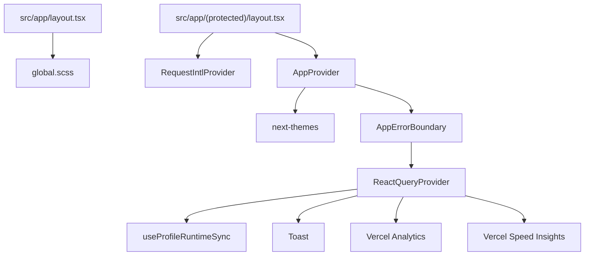

# 07 - Package et runtime

## package.json

```json
{
  "name": "workbench",
  "version": "1.9.1",
  "private": true,
  "scripts": {
    "dev": "next dev",
    "dev:stripe": "stripe listen --forward-to localhost:3000/api/stripe/webhook",
    "dev:all": "concurrently --names next,stripe --prefix-colors blue,magenta \"yarn dev\" \"yarn dev:stripe\"",
    "build": "next build --webpack",
    "start": "next start",
    "lint": "eslint",
    "i18n:check-keys": "node scripts/check-i18n-keys.mjs",
    "format": "prettier --write \"**/*.{ts,tsx,js,jsx,json,css,scss,md}\"",
    "format:check": "prettier --check \"**/*.{ts,tsx,js,jsx,json,css,scss,md}\"",
    "test": "jest",
    "test:watch": "jest --watch",
    "clean:next": "rm -rf .next",
    "clean:next:dev": "rm -rf .next/dev",
    "prepare": "husky"
  }
}
```

## Stack

| Categorie     | Packages                                                               |
| ------------- | ---------------------------------------------------------------------- |
| Framework     | `next@16.1.6`, `react@19.2.1`, `react-dom@19.2.1`                      |
| Data client   | `@tanstack/react-query@5.90.12`, `zustand@5.0.9`                       |
| Backend       | `@supabase/supabase-js@2.102.1`, `@supabase/ssr@0.8.0`                 |
| Forms/schema  | `react-hook-form@7.72.1`, `@hookform/resolvers`, `zod@4.3.6`           |
| i18n/theme    | `next-intl@4`, `next-themes@0.4.6`                                     |
| UI/workflows  | `@dnd-kit/*`, `recharts`, `sass`                                       |
| Payments      | `stripe@22.0.0`                                                        |
| Observability | `@sentry/nextjs@10`, `@vercel/analytics`, `@vercel/speed-insights`     |
| Tooling       | `typescript@5`, `jest@30.2.0`, `ts-jest`, `eslint@9`, `prettier@3.7.4` |

## Runtime Next

`next.config.ts`:

- next-intl plugin.
- Sentry wrapper.
- bundle analyzer via `ANALYZE=true`.
- marketing rewrites:
  - `/` -> `/marketing/fr`
  - `/pricing` -> `/marketing/fr/pricing`
  - secondary locales prefixed.
- Sass include path `./src/styles`.
- `images.remotePatterns` derive de `NEXT_PUBLIC_SUPABASE_URL` pour storage public.
- alias `@` pour webpack et turbopack.
- security headers globaux:
  - `X-Frame-Options: DENY`
  - `X-Content-Type-Options: nosniff`
  - `Referrer-Policy: strict-origin-when-cross-origin`
  - `Permissions-Policy: camera=(), microphone=(), geolocation=()`
  - HSTS.

## Vercel

`vercel.json`:

- cron quotidien `0 0 * * *` sur `/api/jobs/archive-completed-tickets`.
- deployments automatiques seulement sur `main` et `main-dev`.

## Variables d'environnement

| Variable                                       | Usage                                                      |
| ---------------------------------------------- | ---------------------------------------------------------- |
| `NEXT_PUBLIC_SUPABASE_URL`                     | clients Supabase browser/server/edge, image remote pattern |
| `NEXT_PUBLIC_SUPABASE_PUBLISHABLE_DEFAULT_KEY` | clients Supabase publishable                               |
| `SUPABASE_SERVICE_ROLE_KEY`                    | admin client pour webhook, delete user, cron               |
| `NEXT_PUBLIC_SITE_URL`                         | SEO metadata base                                          |
| `STRIPE_SECRET_KEY`                            | Stripe server client                                       |
| `STRIPE_WEBHOOK_SECRET`                        | verification webhook                                       |
| `STRIPE_PRO_PRICE_ID`                          | mapping plan pro                                           |
| `STRIPE_TEAM_PRICE_ID`                         | mapping plan team                                          |
| `CRON_SECRET`                                  | autorisation job archive                                   |
| `SENTRY_DSN` / `NEXT_PUBLIC_SENTRY_DSN`        | Sentry                                                     |
| `SENTRY_AUTH_TOKEN`                            | upload source maps/build Sentry                            |
| `NEXT_PUBLIC_ENABLE_QUERY_DEVTOOLS`            | React Query Devtools en dev                                |
| `NEXT_PUBLIC_LOG_LEVEL`                        | niveau logger                                              |
| `ANALYZE`                                      | bundle analyzer                                            |

## Providers runtime



React Query defaults:

- `staleTime: 24h`
- `gcTime: 24h`
- `retry: 1`
- `refetchOnWindowFocus: false`

Impact:

- tres bon pour eviter les cascades de refetch;
- exige des invalidations precises apres mutations et realtime;
- peut masquer une donnee stale si une mutation externe n'est pas couverte par realtime.

## Qualite et tests

Commandes:

- `yarn test`
- `yarn lint`
- `yarn i18n:check-keys`
- `yarn build`
- `yarn format:check`

Tests observes:

- design-system primitives;
- auth, i18n, errors, routes;
- workspace/project hooks/providers;
- board page/hooks/realtime/components;
- recipes repositories/usecases/components;
- migrations SQL cles;
- API Stripe/auth route tests.

## Risques package/runtime

- Next 16 + presence de `middleware.ts` et `src/proxy.ts`: valider la convention effective et supprimer le doublon.
- `next build --webpack` force webpack malgre presence turbopack alias; clarifier le choix.
- `recharts` n'est utilise que dans `flavieBoard/`, non route: le package peut etre retire si ce dossier est archive.
- Pas de lib d'icones type lucide: si reconstruction mature, ajouter une lib iconographique coherente ou etendre le set interne.
- `concurrently` + Stripe CLI suppose un setup local externe non documente dans scripts.

## Definition runtime cible

- un edge gate canonique, claims-first;
- un set de variables env documente avec validation au boot;
- dashboards Sentry/Vercel relies aux routes critiques;
- tests `build`, `lint`, `test`, `i18n:check-keys` obligatoires en CI;
- bundle analyzer execute sur chaque ajout de dependance lourde;
- separation claire public marketing vs app authenticated providers.
