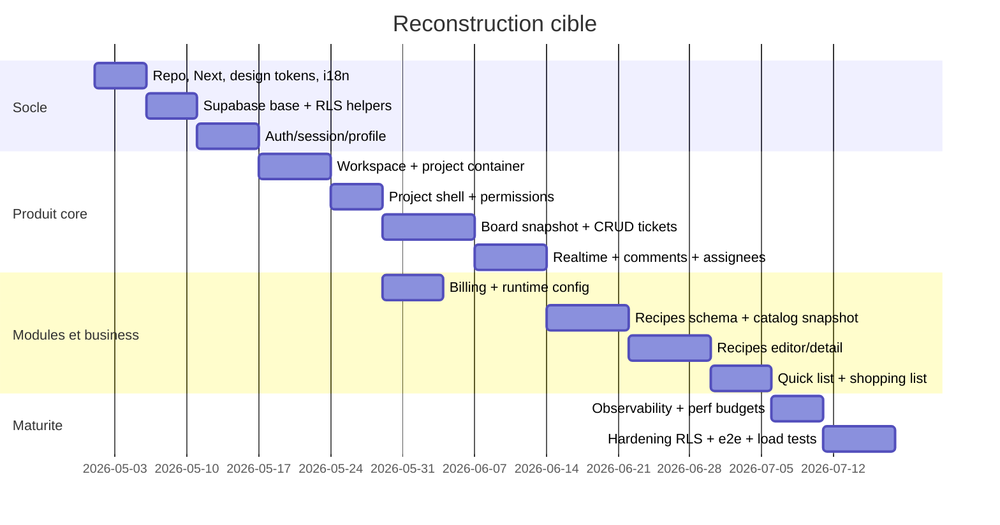

# 08 - Plan d'integration from scratch

Objectif: reconstruire l'application de zero jusqu'a l'etat actuel, mais avec des frontieres de donnees et des performances de produit mature.

## Principe directeur

Construire par vertical slices, mais poser tres tot les contrats de chargement, RLS et read models. Chaque phase doit livrer UI, usecases, persistence, tests et mesure de latence.

## Phase 0 - Decisions avant code

Decisions:

- nom canonique produit/repo;
- edge gate unique: `proxy.ts` ou `middleware.ts`, pas les deux;
- strategie typed DB: generation Supabase types + mappers owner-local;
- conventions query keys et route loaders;
- cible de perf par route.

Livrables:

- ADR architecture;
- checklist env vars;
- schema initial SQL complet;
- budgets:
  - workspace first content < 800ms p75 warm;
  - project board first usable < 1200ms p75 warm;
  - ticket detail < 500ms p75 after prefetch;
  - recipes catalog < 1000ms p75 warm.

## Phase 1 - Socle app

Implementer:

- Next App Router, TypeScript, ESLint, Jest.
- `src/app`, `domains`, `modules`, `shared`.
- design tokens, primitives min: Button, Input, Modal, Loader, Fallback, Toast.
- i18n locale resolution et static translator.
- error model applicatif.
- observability logger + Sentry config.

Tests:

- design primitives;
- routes utils;
- i18n locale detection;
- error mapping.

## Phase 2 - Supabase foundation

Implementer DB:

- extensions UUID/trgm si search.
- `projects`, `project_members`, `user_profiles`, `app_runtime_config`.
- helper RLS: `is_project_member`, `get_project_role`, `is_project_admin`, `can_edit_project`.
- policies optimises avec `(select auth.uid())`.
- indexes FK/RLS des le depart.

Livrables:

- migration unique foundation;
- tests SQL sur policies role admin/member/viewer;
- seed local minimal.

## Phase 3 - Auth/session/profile

Implementer:

- Supabase Auth gateways;
- sign up/sign in/reset/update/verify/OAuth;
- session current + claims-first edge gate;
- user_profiles sync trigger;
- preferences JSONB avec default complet;
- avatars storage.

Optimisation:

- forward session header depuis edge gate pour eviter `getCurrentSession` redondants;
- `React.cache()` pour session server.

Tests:

- auth forms;
- callback redirect sanitization;
- profile preferences fallback;
- storage validation.

## Phase 4 - Workspace/project container

Implementer:

- RPC `create_project` bootstrap admin;
- `get_projects_with_stats` version scope-first;
- workspace page;
- reclaim orphaned projects si conserve;
- project shell snapshot;
- settings projet, membres, invitations.

Optimisation:

- read model `workspace_projects_with_stats` ou RPC stable;
- loader workspace parallele session/profile/projects si possible;
- cache runtime config.

Tests:

- create project;
- membership role changes;
- last admin guard;
- invitation accept/decline/revoke;
- workspace stats query.

## Phase 5 - Board module mature

Implementer DB:

- `boards`, `columns`, `tickets`, `comments`, `ticket_assignees`.
- constraints `ticket.column_id` same project.
- RPCs:
  - `get_board_snapshot(project_id)`
  - `move_and_reorder_ticket`
  - `get_ticket_detail_snapshot(project_id, ticket_id)`
  - `archive_completed_tickets_batch`

Implementer UI:

- board route precharge snapshot complet;
- columns, cards, create modal, filters, search;
- ticket detail;
- comments/assignees;
- DnD.

Optimisation:

- first paint board = une requete DB serveur;
- client hooks consomment snapshot hydrate puis realtime deltas;
- search ticket index trigram/code.

Tests:

- board provisioning;
- DnD move atomic;
- ticket CRUD;
- permissions viewer vs member;
- realtime invalidation helpers;
- archive job.

## Phase 6 - Billing/runtime config

Implementer:

- `subscriptions`;
- plan features;
- pricing page;
- checkout/portal APIs;
- webhook signed;
- runtime config key/value + lab protected.

Optimisation:

- ne charger billing que sur surfaces qui l'affichent;
- server cache billing visibility;
- entitlements summary precharge dans project shell si sidebar en depend.

Tests:

- plan effective degraded statuses;
- checkout hidden when billing disabled;
- webhook mapping price IDs;
- portal requires session.

## Phase 7 - Recipes module mature

Implementer DB:

- `recipes`, `recipe_steps`, `recipe_ingredients`, `recipe_tags`, `recipe_tag_links`, `recipe_selections`, `shopping_lists`, `shopping_list_items`.
- storage `recipe-covers`.
- RLS par project membership/editor.

Read models cibles:

- `get_recipes_catalog_page(project_id, search, filter_ids, cursor, limit)`
- `get_recipe_detail_snapshot(project_id, recipe_id)`
- `get_recipe_editor_snapshot(project_id, recipe_id null)`
- `generate_shopping_list_if_stale(project_id)`

Implementer UI:

- catalog + filters + quick rail;
- detail;
- create/edit;
- quick list;
- shopping list.

Optimisation:

- remplacer fixture fallback par seed explicite ou demo catalog namespace;
- indexer `recipes(project_id, updated_at, id)`, trigram title/summary, ingredients normalized/display, tag links.
- shopping generation par hash de selection graph pour eviter ecriture inutile.

Tests:

- catalog filters/search/pagination;
- editor save graph;
- cover upload;
- quick list selection uniqueness;
- shopping merge rules.

## Phase 8 - Hardening mature

Implementer:

- e2e Playwright happy paths;
- SQL EXPLAIN checks sur queries critiques;
- bundle analyzer budget;
- route metrics;
- chaos tests RLS/session expiration;
- docs runbook.

Definition of done:

- aucune route critique sans loader stable;
- aucune query critique sans index documente;
- aucun write path sans validation usecase + constraint DB;
- aucun role sans test RLS;
- aucun module sans ownership clear: route loader, query keys, read model, mutations, invalidations.
