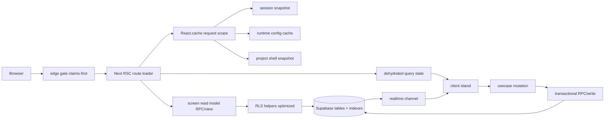
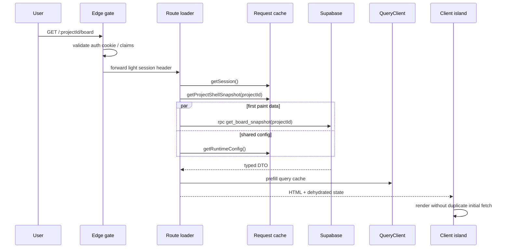
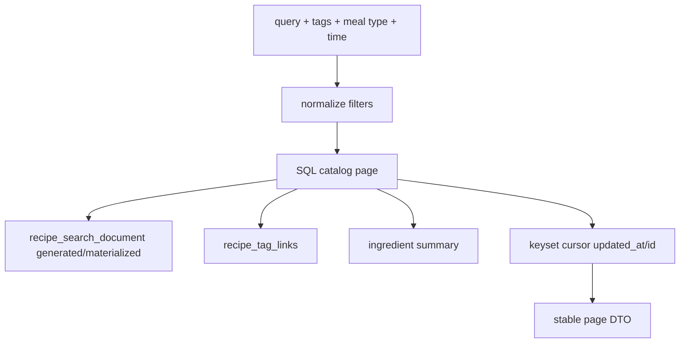
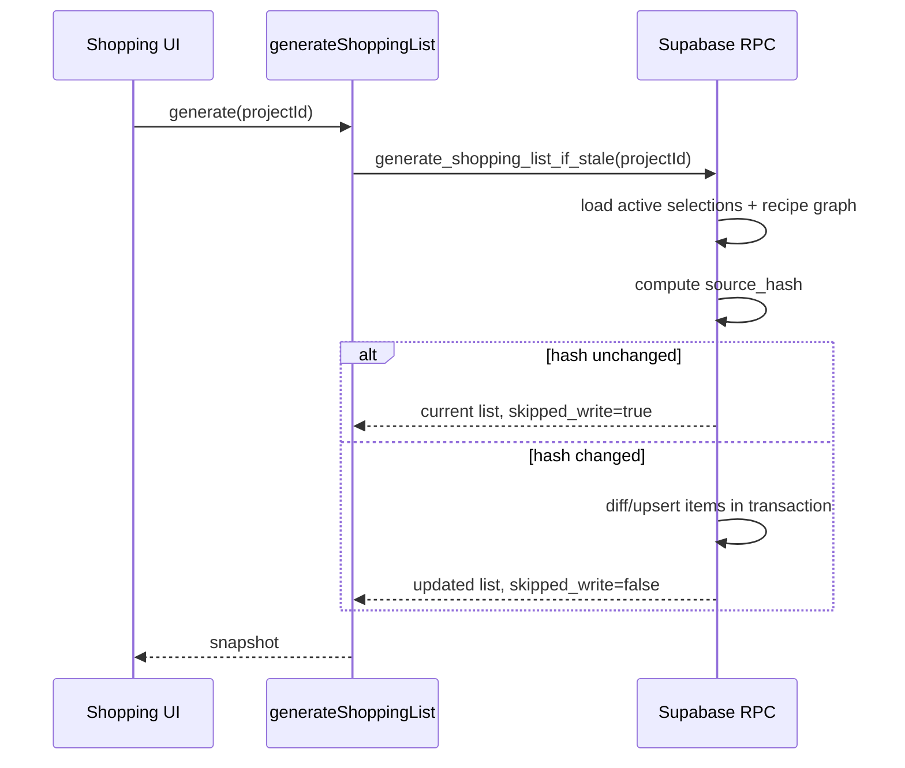

# 09 - Architecture cible ultra performante

Objectif: garder l'intention produit actuelle, mais remplacer les chargements disperses par des contrats de donnees explicites, mesurables et proches des besoins de chaque ecran.

## Principes

1. Une route critique = un data contract documente.
2. Le premier rendu ne depend pas d'une cascade client quand les donnees sont connues cote serveur.
3. Les lectures projet passent par des read models scopes par `project_id` et `auth.uid()`.
4. Les mutations sont petites, transactionnelles, idempotentes si possible, puis invalidations precises.
5. Realtime transporte des deltas et des invalidations, pas le chargement initial.
6. Les caches cross-request ne contiennent jamais de donnees utilisateur non publiques.
7. Les policies RLS restent la frontiere de securite, l'UI et les loaders ne sont que des garde-fous UX.

## Data plane cible



## Contrats par surface

| Surface              | Contrat cible                                                     | Rendu initial                                          | Revalidation                     |
| -------------------- | ----------------------------------------------------------------- | ------------------------------------------------------ | -------------------------------- |
| Marketing home/legal | contenu statique + runtime minimal                                | statique/edge-cacheable                                | build/redeploy                   |
| Pricing              | `billing_visibility` + plans statiques + subscription si connecte | public sans `AppProvider` complet                      | runtime config TTL court         |
| Auth                 | session capability minimale                                       | server redirect + forms client                         | aucun cache user                 |
| Workspace            | `get_workspace_snapshot()`                                        | projects + stats + viewer/profile essentials           | mutations project/invite/profile |
| Project shell        | `get_project_shell_snapshot(project_id)`                          | projet, role, modules, entitlement, runtime flags      | role/module/subscription changes |
| Board                | `get_board_snapshot(project_id)`                                  | board, columns, tickets actifs, assignees, permissions | ticket/column/assignee realtime  |
| Ticket detail        | `get_ticket_detail_snapshot(project_id, ticket_id)`               | ticket, comments, assignees, members utiles            | comment/assignee/ticket realtime |
| Recipes catalog      | `get_recipes_catalog_page(project_id, filters, cursor)`           | page de resultats + tags + quick list ids              | selection/recipe/tag changes     |
| Recipe detail/editor | `get_recipe_detail_snapshot(project_id, recipe_id)`               | graphe complet recette                                 | recipe graph version             |
| Shopping list        | `get_shopping_list_snapshot(project_id)` + `generate_if_stale`    | liste courante + hash source                           | selection/ingredient changes     |
| Account              | `get_account_snapshot()`                                          | viewer, profile, subscription, capabilities            | profile/subscription mutations   |

## Route loader pattern



Regles:

- Les loaders server appellent les usecases/read models, pas directement les composants client.
- Les donnees initiales sont hydratees dans React Query avec les memes query keys que les hooks client.
- Les hooks client ont `initialDataUpdatedAt` ou equivalent quand la fraicheur doit etre controlee.
- Un hook client ne refetch pas au mount si la route vient de lui fournir un snapshot complet.

## Query keys et invalidations

Convention cible:

```text
["session", "current"]
["workspace", "snapshot"]
["project", projectId, "shell"]
["board", projectId, "snapshot"]
["ticket", projectId, ticketId, "detail"]
["recipes", projectId, "catalog", normalizedFilters]
["recipes", projectId, recipeId, "detail"]
["recipes", projectId, "quick-list"]
["recipes", projectId, "shopping-list"]
["account", "snapshot"]
```

Invalidations minimales:

| Mutation                         | Invalider                                                      |
| -------------------------------- | -------------------------------------------------------------- |
| create/update/delete project     | workspace snapshot, project shell concerne                     |
| member role/remove/invite accept | project shell, settings members, board assignee candidates     |
| enable module                    | project shell, sidebar, route access                           |
| create/update/move ticket        | board snapshot, ticket detail concerne                         |
| assign/unassign ticket           | board snapshot, ticket detail                                  |
| create/update/delete comment     | ticket detail only                                             |
| recipe save/delete               | catalog page, recipe detail, shopping stale marker             |
| quick list toggle                | quick list, catalog projected selection, shopping stale marker |
| generate shopping list           | shopping list only                                             |
| subscription webhook             | account snapshot, project shell entitlement                    |

## Supabase/Postgres cible

### RLS

- Utiliser `(select auth.uid())` dans les policies au lieu d'appeler `auth.uid()` par ligne quand possible.
- Ajouter des indexes sur toutes les colonnes utilisees par policies et joins: `project_id`, `user_id`, `ticket_id`, `recipe_id`, `tag_id`, `created_by`, `assigned_by`, `author_id`.
- Garder les helpers security definer petits, stables et indexes-friendly.
- Tester chaque policy par role: admin, member, viewer, non-member.

### Indexes critiques

| Flux                 | Index attendu                                                             |
| -------------------- | ------------------------------------------------------------------------- |
| workspace projects   | `project_members(user_id, project_id)`, `tickets(project_id, updated_at)` |
| board columns        | `boards(project_id)`, `columns(board_id, position)`                       |
| board tickets actifs | `tickets(project_id, archived_at, column_id, position)`                   |
| ticket code/detail   | `tickets(project_id, code_number)`, `tickets(project_id, id)`             |
| comments             | `comments(ticket_id, created_at)`, `comments(project_id)`                 |
| assignees            | `ticket_assignees(project_id, user_id)`, `ticket_assignees(ticket_id)`    |
| recipes catalog      | `recipes(project_id, updated_at, id)`, trigram on title/search document   |
| recipe tags          | `recipe_tag_links(project_id, tag_id, recipe_id)`                         |
| quick list           | `recipe_selections(project_id, status, selected_at)`                      |
| shopping items       | `shopping_list_items(list_id, category, position)`                        |

### Read models

Preferer des RPCs ou vues de lecture qui retournent des DTOs stables:

- `get_workspace_snapshot()`
- `get_project_shell_snapshot(p_project_id uuid)`
- `get_board_snapshot(p_project_id uuid)`
- `get_ticket_detail_snapshot(p_project_id uuid, p_ticket_id uuid)`
- `get_recipes_catalog_page(p_project_id uuid, p_search text, p_tag_ids uuid[], p_cursor jsonb, p_limit int)`
- `get_recipe_detail_snapshot(p_project_id uuid, p_recipe_id uuid)`
- `get_shopping_list_snapshot(p_project_id uuid)`

Chaque read model doit documenter:

- input;
- role minimal;
- tables lues;
- indexes requis;
- shape TypeScript;
- budget p75/p95 local et production.

## Recipes search cible

Etat actuel: le repository peut combiner plusieurs requetes et intersections cote JS.

Cible:



Decisions:

- keyset pagination plutot qu'offset pour volumes reels;
- trigram/full-text sur un document de recherche normalise;
- tags filtres en SQL avec `having count(distinct tag_id)` pour match all;
- quick list projet ramenee sous forme de set `selected_recipe_ids` pour decorer les cartes sans N+1;
- fixture fallback remplace par seed ou demo namespace explicite.

## Shopping list cible

Etat actuel: generation reconstruit la liste et reecrit les items.

Cible mature:

- calculer un `source_hash` a partir des selections actives + versions recettes/ingredients;
- si hash identique, retourner la liste sans ecriture;
- si hash different, faire un diff transactionnel:
  - conserver les items coches quand la cle normalisee existe encore;
  - upsert nouveaux items;
  - marquer `removed_at` ou supprimer seulement les items obsoletes;
  - mettre a jour `shopping_lists.source_hash`.



## Frontend runtime cible

- Segmenter les providers: marketing sans QueryClient/Theme analytics app si inutile.
- Garder les composants serveur comme orchestrateurs de donnees initiales.
- Mettre les ilots client seulement ou il y a interaction: DnD, forms, realtime, filters, mutations.
- Stabiliser les hauteurs de skeletons et des rails latereaux pour limiter le CLS.
- Precharger ticket detail au hover/focus sur les cartes board.
- Eviter les `useEffect` de fetch initial quand un loader server peut fournir la donnee.
- Garder Zustand pour etat local UI uniquement, pas comme cache serveur bis.

## Budgets de performance

| Surface             | p75 warm | p95 warm | Notes                       |
| ------------------- | -------: | -------: | --------------------------- |
| Home marketing      |   400 ms |   800 ms | statique, providers minimum |
| Pricing public      |   500 ms |   900 ms | billing visibility cachee   |
| Auth form           |   500 ms |   900 ms | redirect server rapide      |
| Workspace           |   800 ms |  1500 ms | snapshot unique             |
| Project shell       |   500 ms |   900 ms | request cache               |
| Board usable        |  1200 ms |  2200 ms | snapshot + hydrate          |
| Ticket detail       |   500 ms |  1000 ms | prefetch depuis board       |
| Recipes catalog     |  1000 ms |  1800 ms | SQL search/pagination       |
| Recipe editor       |   900 ms |  1600 ms | graph snapshot              |
| Shopping generation |   800 ms |  1800 ms | no-op si hash identique     |
| Account             |   900 ms |  1600 ms | profile + subscription      |

Les budgets doivent etre mesures sur staging avec donnees representatives: plusieurs projets, 50 membres, 1000 tickets, 500 recettes, 200 selections.

## Observabilite cible

Chaque read model critique logge:

- `route`;
- `project_id` hash ou anonymise;
- `duration_ms`;
- `row_counts`;
- `cache_hit`;
- `cold_start`;
- `user_role`;
- `error_code`.

Dashboard minimal:

- p50/p75/p95/p99 par route;
- top 10 queries lentes;
- taux de redirects fail-closed;
- taux d'erreurs RLS inattendues;
- webhook Stripe failure/retry;
- cron archival duration and rows archived;
- realtime reconnects et missed invalidations.

## Anti-patterns a eviter

- Charger session/profile/subscription separement dans chaque composant.
- Refetcher au mount une donnee deja hydratee.
- Ajouter une policy RLS sans index correspondant.
- Utiliser `offset` sur des listes qui peuvent grandir.
- Faire des intersections de gros resultats cote JS.
- Reecrire une liste persistante sans verifier si le graphe source a change.
- Mettre des donnees utilisateur dans un cache cross-request.
- Laisser `middleware.ts` et `src/proxy.ts` diverger.
- Ajouter une dependance UI lourde pour une seule surface non routee.
