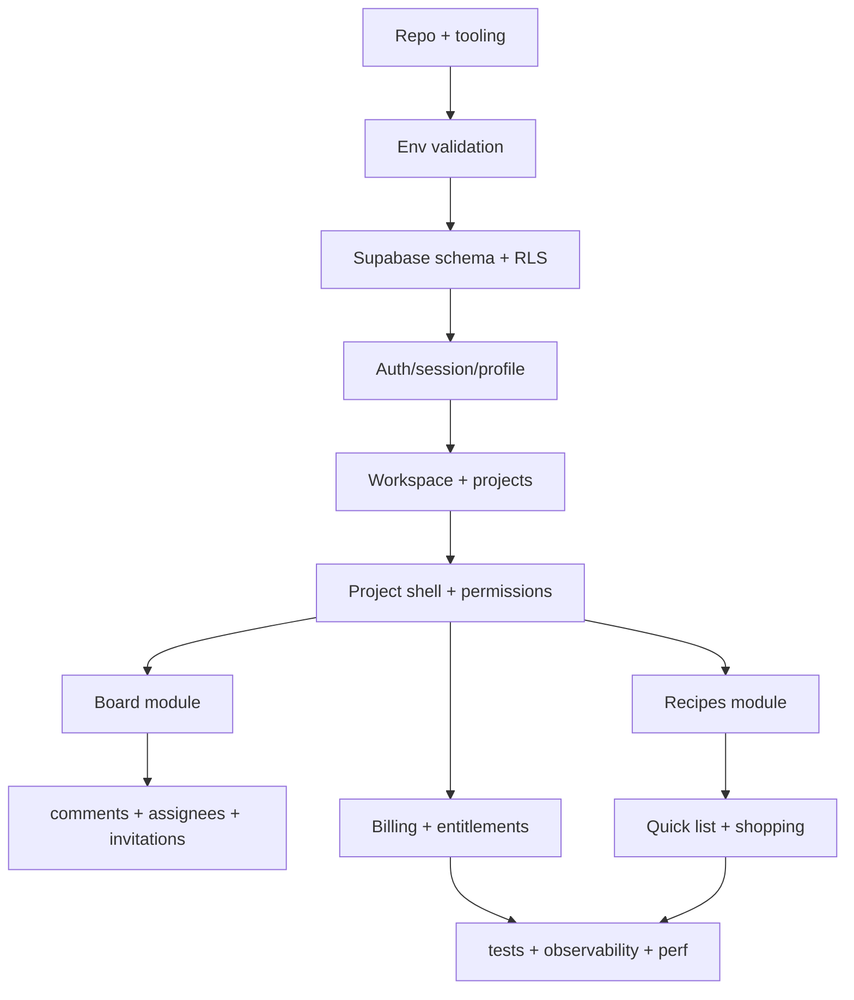
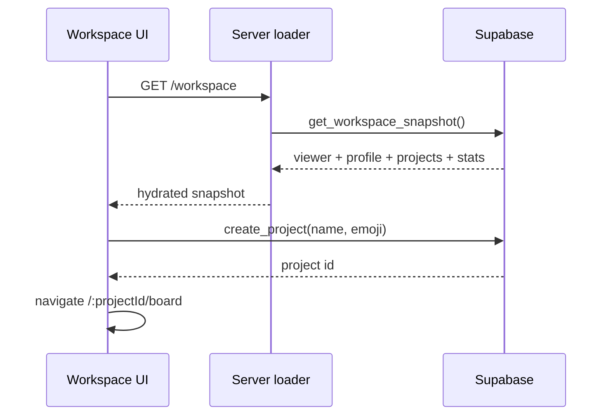

# 10 - Runbook de reconstruction

Ce runbook sert a recréer l'application de maniere fiable, sans chercher le pixel-perfect, mais avec une architecture plus mature que l'etat actuel.

## Prerequis

- Node compatible avec Next 16.
- Yarn active.
- Supabase project local ou distant.
- Stripe CLI si le billing doit etre teste localement.
- Variables d'environnement documentees dans [07 - Package et runtime](./07-package-runtime.md).

Commandes de base:

```bash
yarn install
yarn dev
yarn test
yarn lint
yarn i18n:check-keys
yarn build
```

## Ordre de reconstruction



## 1. Initialiser le repository

1. Installer Next, React, TypeScript, Jest, ESLint, Prettier.
2. Poser les alias `@/*`, Sass include path, next-intl, Sentry wrapper.
3. Creer les dossiers:
   - `src/app`
   - `src/domains`
   - `src/modules`
   - `src/shared`
   - `supabase/migrations`
4. Ajouter `AppProvider` seulement pour l'application authenticated.
5. Garder marketing/public aussi statique que possible.

Definition of done:

- `yarn build` passe sur une app minimale.
- i18n charge le titre et la description.
- error boundary globale presente.

## 2. Poser le schema Supabase

Ordre recommande:

1. Extensions et enums.
2. `user_profiles`.
3. `projects`, `project_members`, `app_runtime_config`.
4. Helpers RLS.
5. Policies et indexes.
6. `boards`, `columns`, `tickets`.
7. `comments`, `ticket_assignees`.
8. `project_invitations`.
9. `subscriptions`.
10. `recipes` et tables associees.
11. Storage buckets.

Verification SQL:

```sql
select public.get_project_role('<project-id>'::uuid);
select * from public.get_projects_with_stats();
select * from public.get_ticket_comments('<ticket-id>'::uuid);
```

Definition of done:

- Toutes les tables sensibles ont RLS active.
- Tous les FKs et colonnes de policy ont un index.
- Les triggers denormalisent `project_id` la ou necessaire.
- Les RPCs critiques sont testees avec au moins admin/member/viewer/non-member.

## 3. Auth/session/profile

Construire:

- signup/signin/reset/update/verify/callback;
- session server helper request-cache;
- edge gate canonique claims-first;
- profile sync trigger;
- preferences profile avec default complet;
- avatar upload/remove.

Points d'attention:

- redirections auth doivent sanitizer le `redirect`;
- email verification doit etre coherent entre edge gate et pages auth;
- OAuth callback doit echanger le code et rediriger de facon deterministic.

Smoke tests:

- signup -> verify si active -> workspace;
- signin -> workspace;
- reset password -> update password;
- signout -> retour public.

## 4. Workspace et projets

Construire:

- `create_project` transactionnel;
- `get_workspace_snapshot` ou `get_projects_with_stats`;
- workspace server loader;
- creation projet avec validation nom + emoji;
- reclaim orphaned project si conserve;
- project settings membres/invitations.

Mermaid cible:



Definition of done:

- workspace first paint ne fait pas de N+1 client;
- create project cree project, member admin, board/columns ou declenche provisioning stable;
- settings refuse les actions admin-only cote UI et DB.

## 5. Project shell

Construire:

- `get_project_shell_snapshot(project_id)`;
- permissions provider;
- sidebar views;
- module library;
- route root redirect vers vue accessible;
- duplication `_isolated` decidee: supprimer, garder comme harness, ou documenter.

Definition of done:

- une seule requete shell par request;
- roles et modules disponibles avant rendu sidebar;
- recipes cachees si flag off, module disabled ou plan locked.

## 6. Board

Construire:

- `get_board_snapshot(project_id)`;
- columns/tickets actifs;
- create/update/delete tickets;
- DnD move avec RPC transactionnelle;
- assignees;
- comments;
- ticket detail snapshot;
- realtime deltas.

Donnees minimales du snapshot:

```text
projectRole
board
columns[]
tickets[]
ticketAssigneesByTicketId
assigneeCandidates[]
permissions
```

Definition of done:

- board utilisable au premier rendu sans attendre une cascade client;
- drag and drop atomique et rollback UI si erreur;
- viewer ne peut pas muter meme via API client directe;
- ticket detail ouvre avec comments et assignees en un contrat de lecture.

## 7. Billing et runtime config

Construire:

- `subscriptions`;
- plans et entitlements;
- pricing page;
- checkout API;
- portal API;
- webhook Stripe signe;
- `app_runtime_config`;
- runtime config lab protege.

Definition of done:

- pricing invisible si billing flag off;
- checkout/portal proteges par origin + rate limit + session;
- webhook utilise service role et ne depend pas d'une session utilisateur;
- entitlement project shell recalcule apres webhook.

## 8. Recipes

Construire:

- schema recipes complet;
- catalog page SQL/read model;
- tags/filter/search;
- detail/editor graph;
- cover storage;
- quick list;
- shopping list idempotente.

Donnees minimales du catalog snapshot:

```text
recipesPage
availableTags
selectedRecipeIds
filters
paginationCursor
projectPermissions
```

Definition of done:

- pas de fixture fallback implicite en production;
- catalog search execute en SQL avec index;
- editor sauve le graphe recette en transaction;
- shopping generation evite les ecritures si source_hash identique.

## 9. Design system

Reconstruire dans cet ordre:

1. tokens CSS: couleurs, spacing, radius, typography, shadows;
2. primitives: Button, Field, Modal, Toast, Loader, Skeleton, EmptyState;
3. layouts: AuthShell, WorkspaceLayout, ProjectShell, RecipesPageScaffold;
4. patterns: cards board, command bars, sidebars, filter sheets;
5. states: loading, empty, error, read-only, pending mutation.

Definition of done:

- chaque ecran a un loading state stable;
- actions iconiques ont tooltip/aria label;
- responsive mobile/tablet/desktop valide;
- aucun texte ne depend d'un container qui peut deborder.

## 10. Observabilite et performance

Ajouter avant release:

- Sentry server/client/edge;
- Vercel Analytics + Speed Insights;
- logs duration pour read models;
- `EXPLAIN` documente sur queries critiques;
- bundle analyzer pour dependances lourdes;
- e2e happy path.

Performance checklist:

| Check               | Attendu                                      |
| ------------------- | -------------------------------------------- |
| `/workspace`        | snapshot unique, p75 < 800 ms warm           |
| `/:projectId/board` | first usable < 1200 ms warm                  |
| ticket detail       | prefetch hover/focus + snapshot < 500 ms p75 |
| recipes catalog     | SQL search + keyset, < 1000 ms p75           |
| shopping generation | no-op si hash inchange                       |
| RLS                 | no sequential scan inattendu sur volume test |
| bundle              | pas de lib lourde pour surface non routee    |

## 11. Jeux de donnees de validation

Creer un seed de staging avec:

- 10 utilisateurs;
- 5 projets;
- 50 membres repartis;
- 1000 tickets;
- 300 commentaires;
- 100 invitations dont expirees;
- 500 recettes;
- 100 tags;
- 200 selections actives;
- 1 liste de courses volumineuse;
- 3 subscriptions dans des statuts differents.

Ces donnees servent a detecter:

- les N+1;
- les policies sans index;
- les pages qui dependent d'un chargement client tardif;
- les listes avec pagination fragile;
- les mutations non idempotentes.

## 12. Quality gates

Avant merge:

```bash
yarn format:check
yarn lint
yarn i18n:check-keys
yarn test
yarn build
```

Avant release:

- smoke auth complet;
- smoke workspace/project/board/ticket;
- smoke settings/invitations;
- smoke recipes catalog/detail/editor/quick-list/shopping;
- smoke billing checkout en mode test;
- cron archival avec `CRON_SECRET`;
- webhook Stripe avec Stripe CLI;
- verification Sentry source maps.

## 13. Definition globale de maturite

L'application est consideree mature quand:

- chaque ecran critique a un contrat de donnees unique et teste;
- chaque contrat a un budget p75/p95;
- chaque table sensible a RLS + tests par role;
- chaque query critique a un index documente;
- chaque mutation a validation usecase + contrainte DB;
- chaque module declare ses query keys et invalidations;
- chaque ecran a loading, empty, error, readonly et pending states;
- aucun doublon d'edge gate ne reste en production;
- les docs PRD restent synchronisees avec les routes, migrations et scripts.
