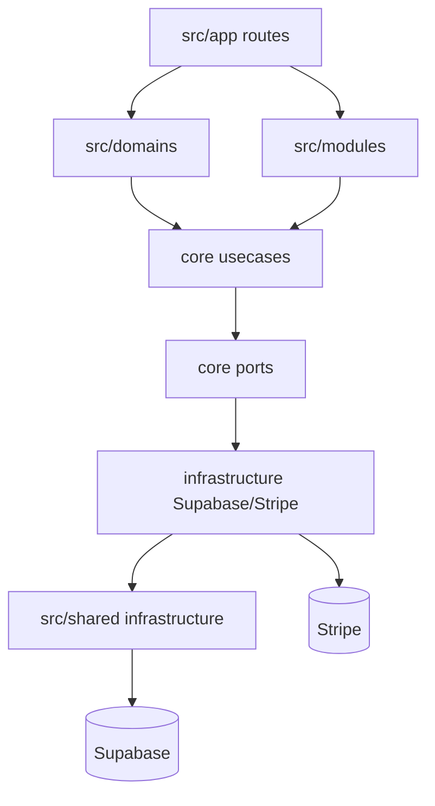

# Tribu Nova / Workbench - Architecture

Status: snapshot codebase du 29 avril 2026.

Ce document remplace l'ancienne note d'architecture baseline. Pour l'analyse complete, lire:

- [02 - Snapshot applicatif](./02-application-snapshot.md)
- [03 - Flux de donnees par ecran](./03-screen-data-flows.md)
- [04 - Base de donnees](./04-database.md)
- [09 - Architecture cible ultra performante](./09-performance-target.md)

## Architecture observee

Responsabilites:

- `src/app`: routes Next App Router, layouts, redirects et APIs.
- `src/domains`: auth, session, profile, viewer, billing, workspace, project, settings, runtime config.
- `src/modules`: board et recipes, modules scopes projet.
- `src/shared`: design system, i18n, erreurs, clients infra, utilitaires.
- `supabase/migrations`: schema, RLS, RPCs, triggers et seeds.

## Points d'architecture importants

- Le shell projet charge un snapshot serveur et expose permissions/modules au client.
- Le board precharge surtout la configuration; tickets et assignees chargent encore cote client.
- Recipes a des guards solides mais plusieurs lectures peuvent etre fusionnees en read models SQL.
- `middleware.ts` et `src/proxy.ts` divergent; la cible mature est un seul edge gate claims-first.
- React Query a un stale time long, donc les invalidations et realtime doivent etre precises.

## Cible

La cible est une architecture par contrats de donnees: une route critique, un loader serveur, un read model DB, une hydration React Query, puis des deltas realtime et des mutations transactionnelles.
